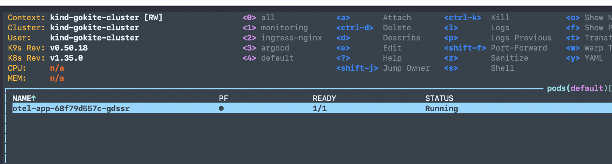
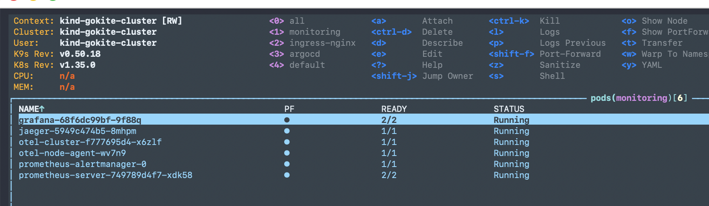
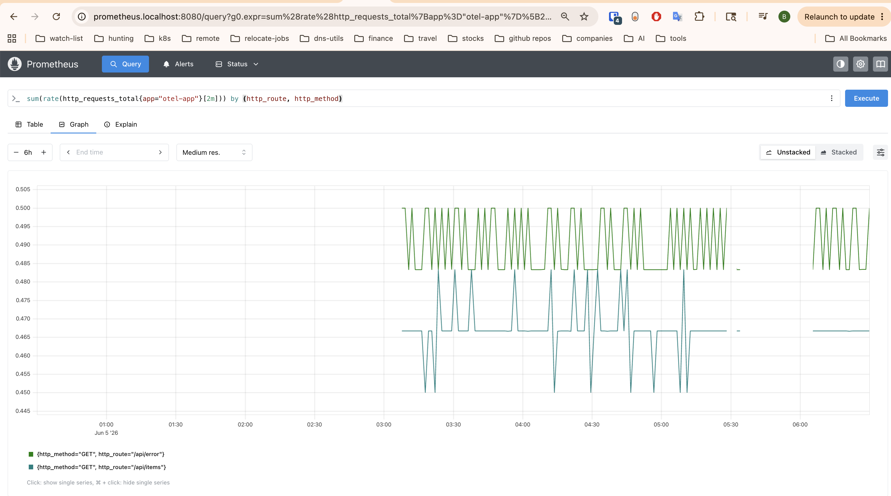
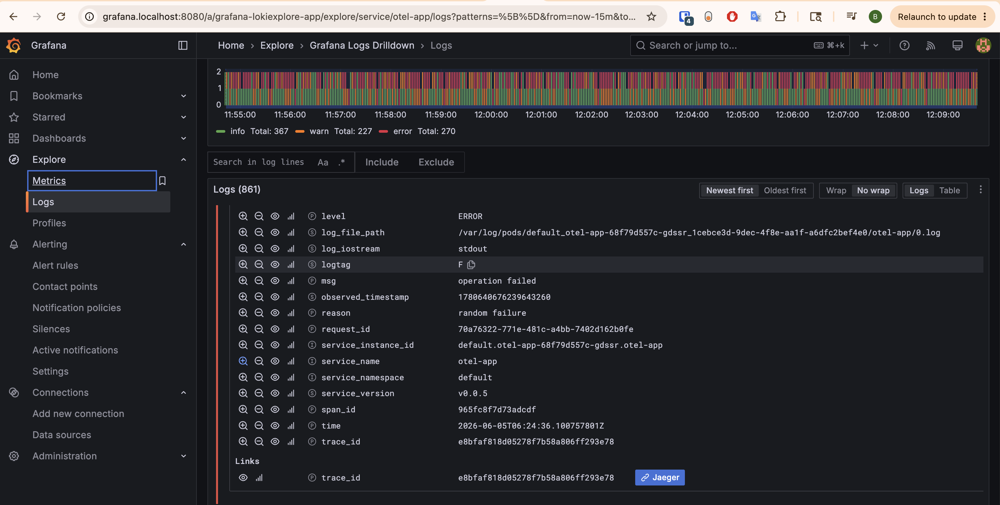
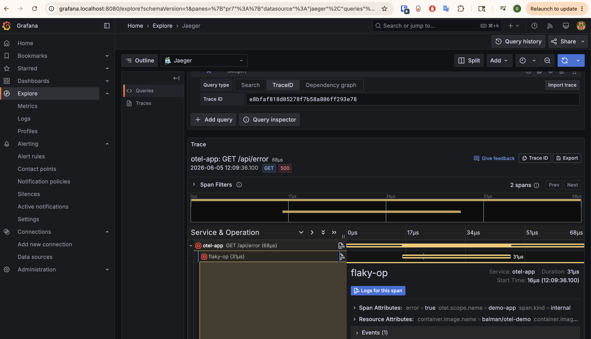
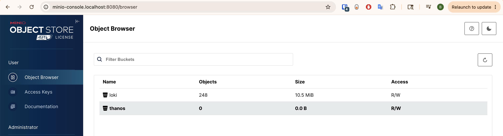

# K8s Config

Production-style Kubernetes observability stack on a local kind cluster, using a two-repository GitOps pattern. This task includes:

- Instrumentation of sample app with otel sdk(All three signals with co-relation)
- CI for building/scanning/semantic tagging/pushing sample app to docker hub
- CI for building helm chart for sample app
- CD with argocd app of apps pattern
- Otel Collector for collection, processing, exporting of telemetry signals
- prometheus, jaeger, loki for storing metrics, traces and logs respectively
- Grafana for visualizing metrics, traces and logs
- Deployed/Tested on kind cluster but should be portable with any k8s cluster.

## Overview

### Repositories

| Repository | Purpose |
|---|---|
| **[otel-app](https://github.com/rbalman/otel-app)** | Go application source, Dockerfile, Helm chart, GitHub Actions CI |
| **[otel-k8s-config](https://github.com/rbalman/otel-k8s-config)** (this repo) | kind cluster config, ArgoCD bootstrap, all observability addon Helm wrapper charts |

### Tools

| Category | Tool | Role |
|---|---|---|
| **Cluster** | [kind](https://kind.sigs.k8s.io) | Local Kubernetes cluster via Docker |
| **GitOps** | [ArgoCD](https://argo-cd.readthedocs.io) | Continuous delivery, app-of-apps pattern, sync waves |
| **Package mgmt** | [Helm](https://helm.sh) | Wrapper charts for all addons and the app |
| **CI** | [GitHub Actions](https://github.com/features/actions) | Build, scan, push image; release Helm chart |
| **Container registry** | [Docker Hub](https://hub.docker.com) | Hosts `balman/otel-demo` app image |
| **Ingress** | [ingress-nginx](dev/addons/ingress/README.md) | Host-based routing (`*.localhost`) |
| **Object storage** | [MinIO](dev/addons/minio/README.md) | S3-compatible backend for Loki |
| **Metrics** | [Prometheus](dev/addons/prometheus/README.md) | Metrics storage, OTLP receiver |
| **Visualization** | [Grafana](dev/addons/grafana/README.md) | Dashboards (sidecar provisioning), alerting |
| **Logs** | [Loki](dev/addons/loki/README.md) | Log aggregation, stored in MinIO |
| **Traces** | [Jaeger](dev/addons/jaeger/README.md) | Distributed trace storage and UI |
| **Telemetry pipeline (cluster)** | [OTel Collector — cluster](dev/addons/otel-cluster/README.md) | Receives OTLP, scrapes pods, fans out to Prometheus/Jaeger |
| **Telemetry pipeline (node)** | [OTel Collector — node](dev/addons/otel-node/README.md) | Collects kubelet/host metrics and pod logs, fans out to Prometheus/Loki |
| **Security scanning** | [Trivy](https://trivy.dev) + [govulncheck](https://pkg.go.dev/golang.org/x/vuln/cmd/govulncheck) | Container image scan, Go vulnerability check in CI |
| **App language** | [Go](https://go.dev) | Demo service with OTel SDK instrumentation |

---

## Prerequisites

- [kind](https://kind.sigs.k8s.io/docs/user/quick-start/#installation)
- [kubectl](https://kubernetes.io/docs/tasks/tools/)
- [helm](https://helm.sh/docs/intro/install/)

---

## Getting Started

NOTE: In production, terraform should be used to create cluster, install argocd and boostrap argocd app of apps.

### 1. Create the cluster

```bash
kind create cluster --config kind.yaml
kubectl cluster-info --context kind-test-cluster
```

### 2. Install ArgoCD

```bash
helm upgrade --install argocd dev/argocd \
  --namespace argocd \
  --create-namespace \
  --dependency-update
```

Wait for ArgoCD to become ready (`kubectl get pods -n argocd -w`) and retrieve the initial admin password:

```bash
kubectl get secret argocd-initial-admin-secret \
  --namespace argocd \
  -o jsonpath="{.data.password}" | base64 -d && echo
```

### 3. Bootstrap the argocd apps using app of apps pattern

```bash
kubectl apply -f dev/addons/bootstrap.yaml
kubectl apply -f dev/apps/bootstrap.yaml
```

This creates the ArgoCD Applications which render the Helm wrapper charts under `dev/addons/` and `dev/apps/` and deploy all components in sync-wave order:

| Wave | Component | Namespace |
|---|---|---|
| 1 | ingress-nginx | `ingress-nginx` |
| 1 | MinIO | `minio` |
| 2 | Prometheus | `monitoring` |
| 2 | Grafana | `monitoring` |
| 3 | Loki | `loki` |
| 3 | Jaeger | `monitoring` |
| 4 | OTel Collector (cluster) | `monitoring` |
| 4 | OTel Collector (node) | `monitoring` |

---

## Accessing Services

Once ingress controller is deployed services are exposed via ingress on port `8080`. Add the following entries to `/etc/hosts` if CLI tools need to resolve them (browsers handle `*.localhost` automatically):

```
127.0.0.1 argocd.localhost
127.0.0.1 grafana.localhost
127.0.0.1 prometheus.localhost
127.0.0.1 jaeger.localhost
127.0.0.1 minio.localhost
127.0.0.1 minio-console.localhost
127.0.0.1 otel-app.localhost
```

| Service | URL | Credentials |
|---|---|---|
| ArgoCD | http://argocd.localhost:8080 | `admin` / retrieved above |
| Grafana | http://grafana.localhost:8080 | `admin` / `changeme` |
| Prometheus | http://prometheus.localhost:8080 | — |
| Jaeger | http://jaeger.localhost:8080 | — |
| MinIO Console | http://minio-console.localhost:8080 | `minioadmin` / `minioadmin` |
| OTel App | http://otel-app.localhost:8080 | — |

---

## Tasks

| # | Title | Doc |
|---|---|---|
| Part 1 | Application Deployment | [otel-app repository README](https://github.com/rbalman/otel-app) |
| Part 2 | CI/CD Pipeline | [otel-app repository README](https://github.com/rbalman/otel-app) |
| Part 3 | GitOps (ArgoCD-style) | [docs/gitops-argocd.md](docs/gitops-argocd.md) |
| Part 4 | Observability | [docs/observability.md](docs/observability.md) |
| Part 5 | Debugging: Ingress 502/504 | [docs/debugging-ingress-502-504.md](docs/debugging-ingress-502-504.md) |
| Part 6 | Security & Best Practices | [docs/security-best-practices.md](docs/security-best-practices.md) |

---

## Demo Screenshots

**Default namespace** — otel-app pod running in the default namespace.


**Monitoring namespace** — all observability stack pods (Prometheus, Grafana, Loki, Jaeger, OTel Collector) running healthy.


**Prometheus** — querying HTTP request rate for the otel-app broken down by route and method.


**Logs** — structured logs from the otel-app in Grafana Loki with direct trace correlation links to Jaeger.


**Traces** — end-to-end distributed trace for `otel-app GET /api/error` viewed via Grafana's Jaeger data source.


**MinIO** — object browser showing the Loki bucket (10.5 MiB) used as S3-compatible log storage backend.

