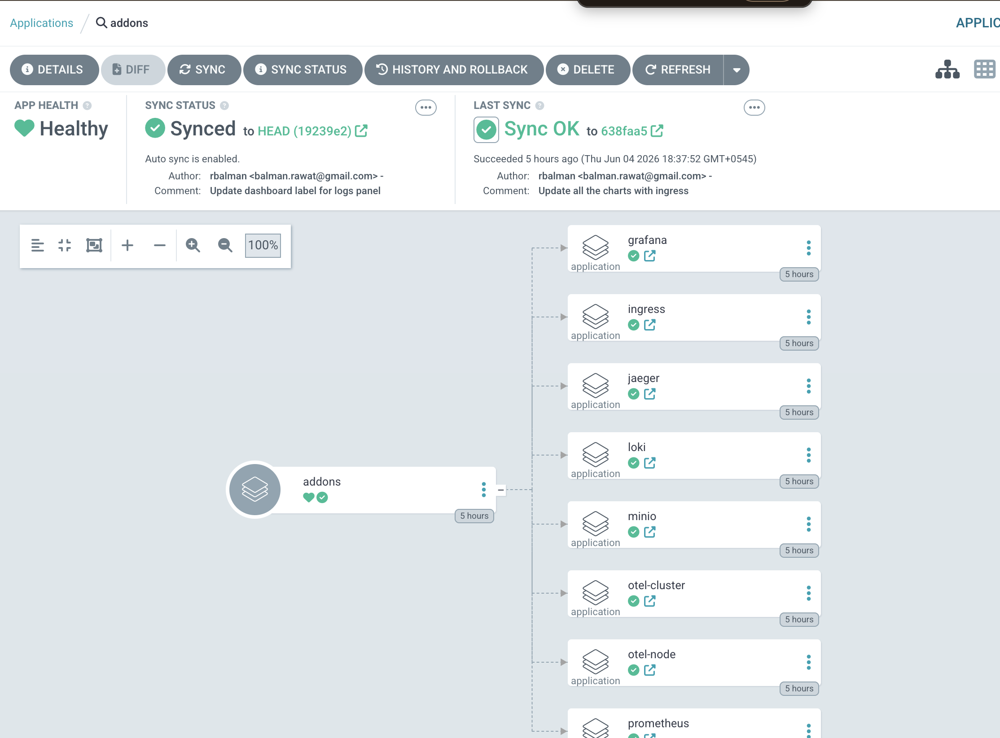

# Part 3 — GitOps (ArgoCD-style)

## Architecture Overview

App-of-apps pattern: a single root ArgoCD Application renders a Helm chart that generates all child Applications dynamically. Application code lives in a separate repo from deployment config.

---

## Repository Structure

```
gokite/
├── kind.yaml
├── dev/                       #environment folder
│   ├── argocd/
│   ├── addons/
│   │   ├── bootstrap.yaml      # ArgoCD Application for the addon stack
│   │   ├── stack/              # App-of-apps chart (controls all addons)
│   │   ├── ingress/
│   │   ├── minio/
│   │   ├── prometheus/
│   │   ├── grafana/
│   │   ├── loki/
│   │   ├── jaeger/
│   │   ├── otel-cluster/
│   │   └── otel-node/
│   └── apps/
│       ├── bootstrap.yaml      # ArgoCD Application for the app stack
|       ├── stack/              # App-of-apps chart (controls all apps)
│       └── otel-app/           # otel-app wrapper chart + Grafana dashboard + alert rules
```

### Multi-Environment Design

Each environment is a top-level directory with its own `values.yaml` files, sharing chart definitions but differing in configuration (resources, storage, replicas).

```
├── dev/      # kind, minimal resources, in-memory Jaeger
├── staging/  # (future) persistent storage, real certs
└── prod/     # (future) HA, external secrets, larger limits
```

---

## How to Deploy

```bash
# 1. Create cluster
kind create cluster --config kind.yaml

# 2. Install ArgoCD (only manual step)
helm upgrade --install argocd dev/argocd \
  --namespace argocd --create-namespace --dependency-update

# 3. Bootstrap — ArgoCD takes over from here
kubectl apply -f dev/addons/bootstrap.yaml
kubectl apply -f dev/apps/bootstrap.yaml
```

### App of Apps

`bootstrap.yaml` is the only manifest applied manually. It points ArgoCD at `dev/addons/stack` — a Helm chart whose sole job is to generate ArgoCD `Application` resources for every addon via a `range` loop over `values.yaml`.

```yaml
# dev/addons/stack/values.yaml
appRepo: https://github.com/rbalman/gokite.git
revision: HEAD
addonsPath: dev/addons

apps:
  prometheus:
    enabled: true      # set false to disable without deleting the entry
    syncWave: "2"      # controls deployment order across addons
    namespace: monitoring
  grafana:
    enabled: true
    syncWave: "2"
    namespace: monitoring
  loki:
    enabled: true
    syncWave: "3"
    namespace: loki
  # ... one entry per addon
```

Each entry becomes a fully-formed ArgoCD `Application` pointing to `dev/addons/<name>`. Adding a new addon is a single entry in this file plus a new `Chart.yaml` + `values.yaml` under `dev/addons/<name>/`.


App of Apps structure in argocd



---

## Design Decisions

- **App-of-apps via Helm** — entire addon list in one `values.yaml`, no extra CRDs beyond base ArgoCD.
- **Helm wrapper charts** — each addon is a thin chart with one upstream dependency; upgrades are a one-line version bump.
- **App and config in separate repos** — CI pushes images, infra repo owns what version runs where; the two concerns never cross.
- **Dashboards colocated with the app** — deploying the app automatically provisions its Grafana dashboard and alert rules.
- **`enabled` flag per addon** — toggle expensive components off without removing their config.

---

## Improvements

- **External Secrets Operator** to remove plaintext credentials from `values.yaml`.
- **ArgoCD Image Updater** to auto-commit image tag bumps and close the CI→CD loop without manual edits.
- **PostSync smoke-test hooks** for stronger wave completion guarantees beyond readiness probes.
- **ArgoCD Projects + RBAC** to separate infra and app deployment permissions in a team setting.
- **Single Sign On With Private Endpoint** for acessing argocd
- **Use Private Repos** Auth with Github Apps
- **User Terraform** to bootstrap cluster, argocd and app-of-apps. (At the moment only manual steps are creating cluster, argocd and deploying app of apps.)
