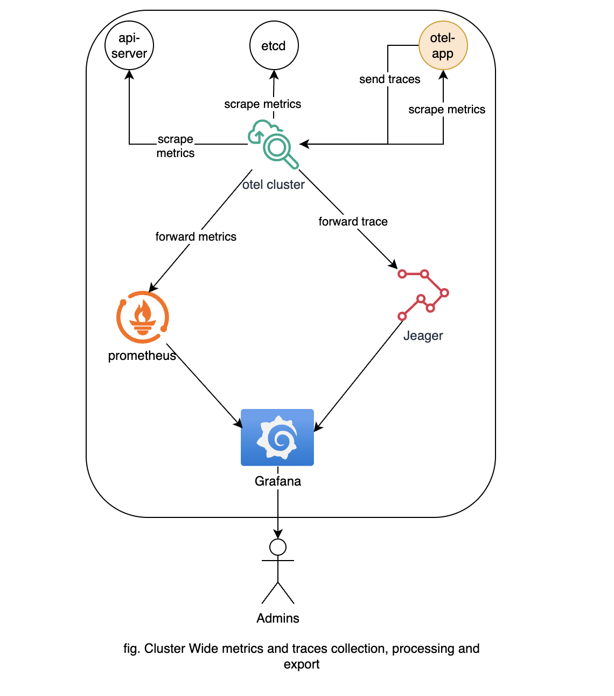
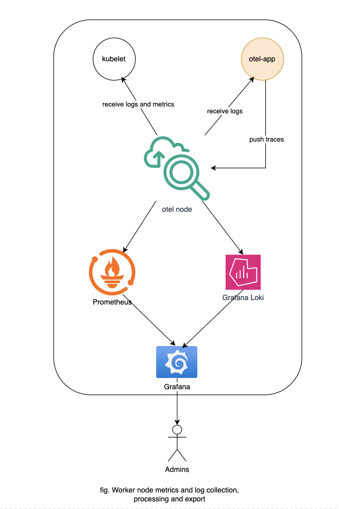
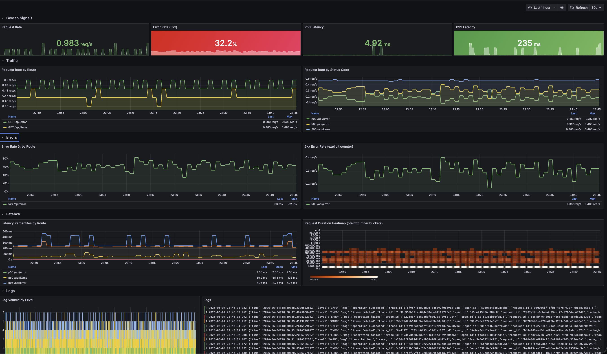

# Part 4 — Observability

## Overview

The app is instrumented using the OpenTelemetry SDK — vendor-agnostic by design. As the observability landscape keeps evolving, OTel provides a future-proof standard with the freedom to swap backends without changing instrumentation code.

Telemetry flows through two OTel Collectors before reaching the storage backends:

- **otel-cluster** — handles OTLP ingestion from the app, cluster-wide metrics, and fan-out to all backends.
- **otel-node** — runs on every worker node; collects kubelet stats, node metrics, and tails container logs.
- **Loki** stores logs in MinIO (S3-compatible). **Prometheus** stores metrics on disk. **Jaeger** uses in-memory storage (dev only).




---

## Metrics

Pod annotations enable auto-scraping by the OTel node collector.

```yaml
podAnnotations:
  prometheus.io/scrape: "true"
  prometheus.io/path: /metrics
  prometheus.io/port: "8080"
```

## Logs

Container logs are tailed by the `otel-node` collector's `logsCollection` preset and shipped to Loki. Structured JSON logs with a `level` field enable per-level filtering in Grafana.

---

## Traces

The app sends traces via OTLP to `otel-cluster`, which forwards to Jaeger. Traces and logs are correlated via `trace_id` — clicking a trace ID in a Loki log line jumps directly to the span in Jaeger.

---

## Dashboard

Provisioned automatically via a ConfigMap labeled `grafana_dashboard: "1"`

**OTel App — Golden Signals** (`dev/apps/otel-app/templates/dashboard-configmap.yaml`)

| Row | Panels | Signal |
|---|---|---|
| Golden Signals | Request Rate, Error Rate %, P50, P99 | At-a-glance stats |
| Traffic | Rate by route, rate by status code | Rate |
| Errors | Error % per route, 5xx rate | Errors |
| Latency | P50/P95/P99 by route, duration heatmap | Duration (bonus) |
| Logs | Log volume by level, raw log stream | Logs |


Dashboard


---

## Alerts

Currently configured alert (!Manually done)

| Alert | Condition | Severity |
|---|---|---|
| High HTTP Error Rate | 5xx rate > 5% for 2m | critical |

---

## Design Decisions

- **OTel Collector as the central entity** for collecting, processing, and exporting all telemetry signals — decouples the app from backends entirely.
- **Dynamic dashboard provisioning** via Grafana sidecar — dashboards live alongside the app chart in Git, no UI interaction needed.
- **Dynamic pod metrics scraping** via annotations — any pod with `prometheus.io/scrape: "true"` is picked up automatically.
- **Traces and logs correlated** via `trace_id` and `span_id` attributes — navigate from a Loki error log directly to its trace in Jaeger.

---

## Improvements

- **Scalable metrics storage** — replace Prometheus with Thanos or Mimir for long-term retention
- **Scalable trace storage** — replace Jaeger in-memory with a persistent backend (Jaeger + Cassandra/ES, or Grafana Tempo).
- **Managed object storage** — replace MinIO with a real S3 bucket in non-dev environments.
- **Incident management** — wire Grafana alerts to PagerDuty or Rootly for on-call routing.
- **SSO + private endpoints** — Grafana and Prometheus UIs should be behind SSO and not publicly accessible in prod.
- **Dedicated observability cluster** — centralise all observability backends if need to be shared by all envs.
- **Tune resources, retention, and compaction** — right-size collector memory limits, set Prometheus retention periods, and configure Loki compaction.
